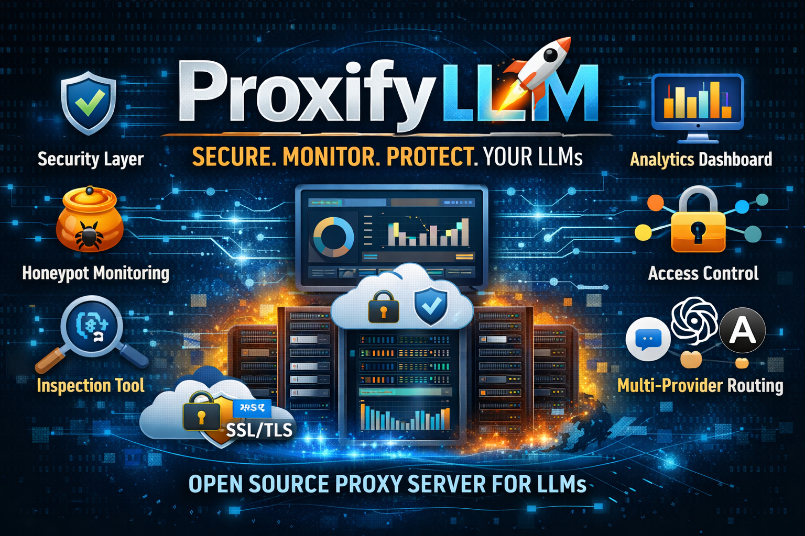
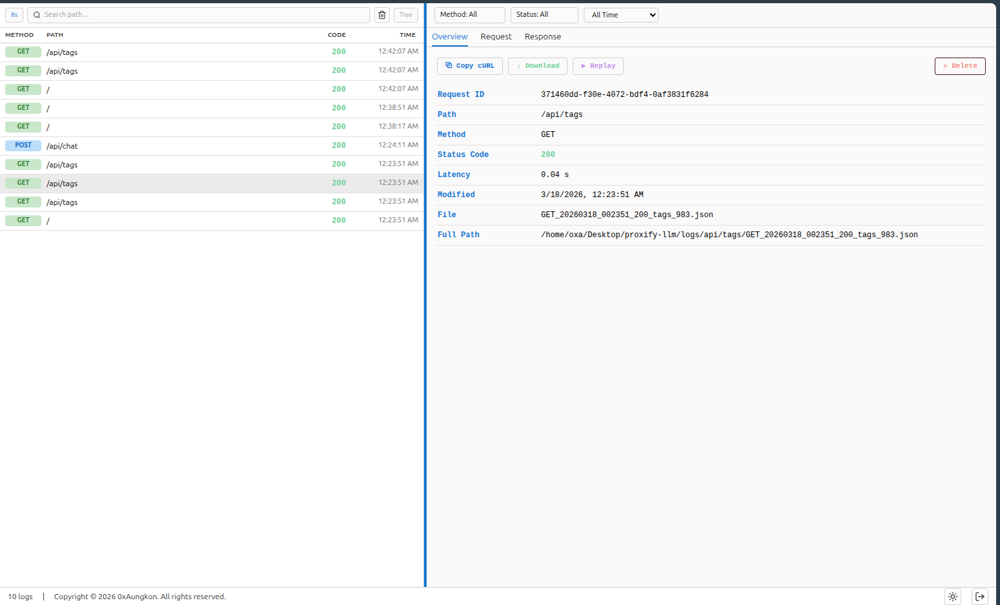
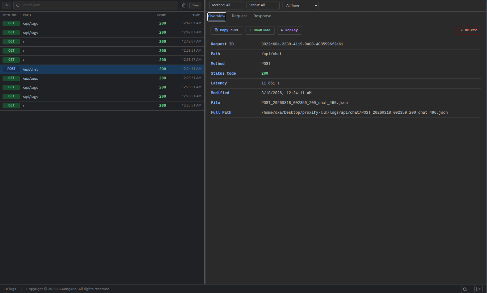
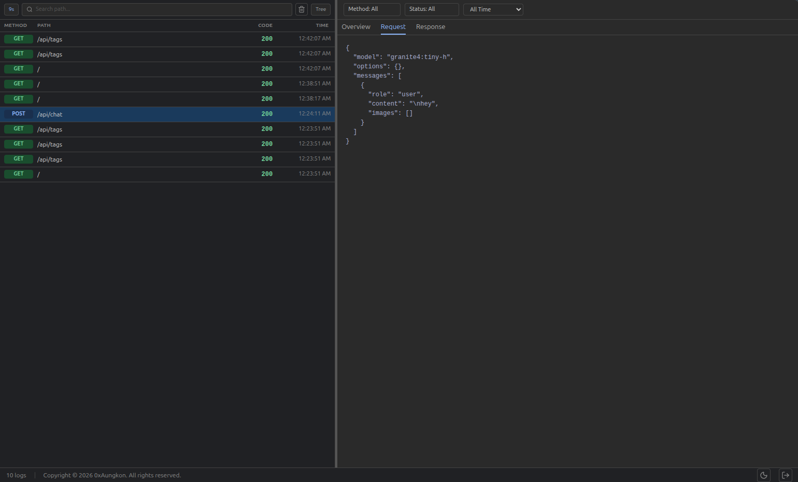
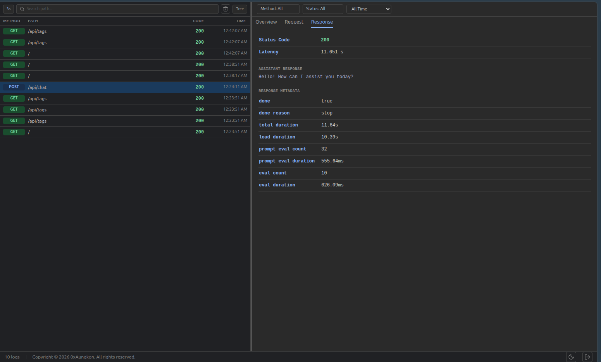

# Proxify LLM


A sophisticated proxy server for LLM providers designed to provide **security**, **monitoring**, and **intelligence** for your language models. Proxify LLM acts as a protective layer between your applications and LLM backends, providing comprehensive logging, authentication, request inspection, and detailed analytics.


 


## What is Proxify LLM?

Proxify LLM is more than just a proxy server—it's a multi-layered security and monitoring solution:

- **🛡️ Protection Layer**: Secure all incoming requests to your LLM with authentication and rate limiting
- **🍯 Honeypot**: Monitor and log all interactions, detecting suspicious patterns and unauthorized access attempts
- **👁️ Inspection Tool**: Reverse engineer and understand how external tools communicate with your models in real-time
- **📊 Intelligence Dashboard**: Real-time visualization of all requests, responses, and system behavior
- **🔐 Security Gateway**: Implement role-based access control and fine-grained routing policies

## Core Features

- **Proxy Server**: Full-featured reverse proxy for Ollama Provider with streaming response support
- **Comprehensive Logging**: All incoming requests and outgoing responses logged to file with detailed metadata
- **Real-Time Dashboard**: Web-based interface for monitoring logs, analyzing traffic, and inspecting request/response data
- **Authentication**: Built-in support for basic authentication with `--auth` flag
- **SSL/TLS Support**: Generate and manage self-signed certificates with `--ssl` flag
- **Flexible Configuration**: Command-line arguments for host, port, authentication, and SSL configuration
- **Tunneling Capabilities**: Built-in support for Pinggy SSH tunneling for secure external access
- **Multi-Provider Support**: Extensible architecture for supporting multiple LLM providers (OpenAI, Anthropic, etc.)
- **Advanced Routing**: Route requests based on conditions, headers, and custom rules

## Quick Start

### Prerequisites
- Python 3.12+
- Ollama running locally (or accessible network address)

### Setup

1. **Clone and Configure**
   ```bash
   cp .env.example .env
   ```

2. **Start the Proxy**
   ```bash
   make run
   ```

3. **Access the Dashboard**
   Open your browser and navigate to: `http://localhost:11435/app/login`

4. **Configure Your LLM Clients**
   Replace your Ollama endpoint with:
   ```
   http://localhost:8000
   ```
5. **Login to Dashboard**
   Use the credentials from your `.env` file

### Enable Pinggy Tunnel (Optional)

Tunnel your local Proxify service to the internet using Pinggy:

**Basic tunnel with default credentials:**
```bash
make run-tunnel-pinggy
```

**Tunnel with custom Pinggy token:**
```bash
make run-tunnel-pinggy-custom TUNNEL_TOKEN=HyhsrQGeh96@free.pinggy.io
```

Or run directly:
```bash
uv run main.py --tunnel pinggy --tunnel-token YOUR_TOKEN@free.pinggy.io
```

The public tunnel URL will be displayed in the terminal (e.g., `https://yuadz-103-161-106-111.a.free.pinggy.link`)

## Dashboard

Proxify LLM provides a comprehensive web-based dashboard for monitoring all LLM traffic:

### Overview Tab 
 
Get a high-level overview of all requests traffic patterns in real-time.

### Request Details

Browse history of all API calls with filtering and search capabilities to find specific requests.

### Request Log

Inspect individual requests with full request metadata, headers, body content, and response information.

### Response Analysis

View detailed response data including model outputs, processing time, and evaluation metrics.

## Use Cases

### 1. **Security & Access Control**
Monitor and authenticate all requests to your LLM infrastructure. Implement role-based access and audit trails for compliance.

### 2. **Honeypot & Threat Detection**
Capture and analyze suspicious patterns, unauthorized access attempts, and malicious requests targeting your LLM.

### 3. **Usage Analytics & Cost Tracking**
Track all API usage with detailed metrics to monitor costs and identify optimization opportunities.

### 4. **Reverse Engineering & Integration Testing**
Understand how external tools and applications communicate with your LLM. Useful for integration testing and debugging.

### 5. **Development & Debugging**
Inspect full request/response cycle during development to debug integration issues and validate API behavior.

## Development Roadmap

- [x] Phase 1: Basic Proxy Server for Ollama
  - Basic proxy functionality
  - Request/response logging to files
  
- [x] Phase 2: Web Dashboard
  - Real-time log monitoring dashboard
  - Request/response inspection
  
- [x] Phase 3: Tunneling & External Access
  - pinggy integration
  
- [ ] Phase 4: Multi-Provider Support
  - OpenAI API support
  - Anthropic API support
  - Advanced routing rules by provider

## Configuration

### Environment Variables

See `.env.example` for all available configuration options:

```env
PROXY_HOST=0.0.0.0              # Host to bind proxy to
PROXY_PORT=8000                 # Port to bind proxy to
LOG_FOLDER=logs                 # Directory for storing logs
LOG_RETAIN_DAYS=7               # Days to keep logs
ADMIN_USERNAME=admin            # Dashboard login username
ADMIN_PASSWORD=adminpassword    # Dashboard login password
SECRET_KEY=<random-key>         # Secret key for session management
OLLAMA_HOST=http://localhost    # Ollama server address
OLLAMA_PORT=11434               # Ollama server port
```

## Architecture

```
┌─────────────┐
│  Client App │
└──────┬──────┘
       │ HTTP/HTTPS
       ▼
┌──────────────────────────┐
│  Proxify LLM             │
│  ┌────────────────────┐  │
│  │ Authentication     │  │
│  │ SSL/TLS            │  │
│  │ Request Logging    │  │
│  │ Response Logging   │  │
│  └────────────────────┘  │
└──────┬───────────────────┘
       │ HTTP
       ▼
┌──────────────────┐
│  Ollama Server   │
│  (or other LLM)  │
└──────────────────┘
```

## License

This project is licensed under the MIT License.

## Support

For issues, questions, or contributions, please open an issue or submit a pull request.